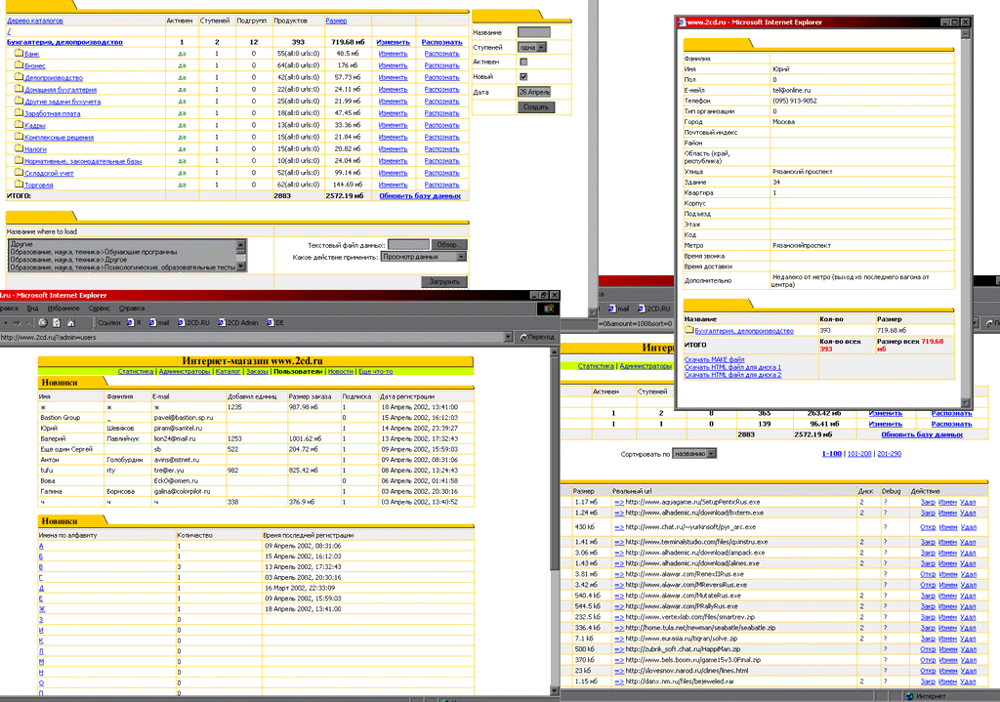

Мой первый серьезный проект, который я написал в 2001-2002 году.
2cd.ru - интернет-магазин по продаже CD-дисков с самостоятельным формированием контента.
Содержал каталог софта, который можно накидать на свою виртуальную болванку и получить её курьером.
Можно посмотреть визуал в архиве интернета:
https://web.archive.org/web/20020528031553/http://www.2cd.ru/

Стэк: PHP5, MySQL, Javascript, Html, Css.

